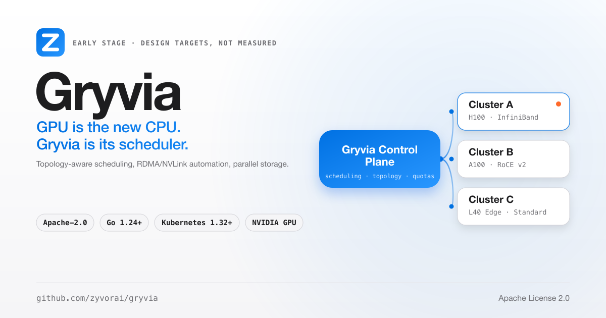

<div align="center">

<picture>
  <source media="(prefers-color-scheme: dark)" srcset="docs/social/gryvia-share-card-dark.png">
  
</picture>

# Gryvia

**GPU is the new CPU. Gryvia is its scheduler.**

[](LICENSE)
[](https://go.dev/)
[](https://kubernetes.io/)
[](https://nvidia.com)

[**Quick Start**](#quick-start-bare-metal) · [**Docs**](website/docs/intro.md) · [**Architecture**](#architecture) · [**Demo**](#5-minute-demo) · [**License**](#license)

</div>

> **Status: early and under active development.** Performance figures in this repository are
> design targets, not measured results — see [Performance Metrics](#performance-metrics).

---

## The problem, the shape of the fix

Modern AI infrastructure is broken in a specific way: GPUs sit idle from poor scheduling and
fragmentation, distributed training is slow because network bottlenecks kill multi-node scaling,
storage can't keep up with data loading, and teams burn weeks hand-tuning NCCL, RDMA, drivers and
topology before training even starts. No single platform ties GPU scheduling, networking, storage
and observability together.

Gryvia is a Kubernetes-native GPU platform: submit a job, and topology-aware scheduling, RDMA/NVLink
configuration and parallel-filesystem storage are handled for you instead of hand-tuned per cluster.
Built for teams training large models, not running containers.

<table width="100%">
<tr>
<td valign="top" width="33%">

**Gang scheduling + fair-share**<br>
Distributed jobs are placed atomically or not at all, with DRF fair-share queuing, backfill and
priority preemption.<br>
[Scheduling guide](website/docs/guides/SCHEDULING.md)

</td>
<td valign="top" width="33%">

**RDMA + NVLink automation**<br>
SR-IOV, RDMA and NCCL are configured by the network operator instead of by hand, targeting
InfiniBand and RoCE v2.<br>
[Storage & network operators](website/docs/guides/STORAGE_NETWORK_OPERATORS.md)

</td>
<td valign="top" width="33%">

**Parallel-filesystem storage**<br>
Per-job provisioning for VAST, Weka, DDN, Lustre and CephFS, with RDMA storage access where the
hardware supports it.<br>
[Storage & network operators](website/docs/guides/STORAGE_NETWORK_OPERATORS.md)

</td>
</tr>
<tr>
<td valign="top" width="33%">

**Six Kubernetes operators**<br>
GPU, AI workload, storage, network, quota and network-intelligence operators, each a real
controller with its own CRDs.<br>
[Core components](#core-components)

</td>
<td valign="top" width="33%">

**Network Intelligence (NetPredator)**<br>
eBPF-powered service graph, per-service p50/p95/p99 latency, anomaly detection and auto-generated
network policies, built on Cilium.<br>
[Network Intelligence guide](website/docs/guides/NETWORK_INTELLIGENCE.md)

</td>
<td valign="top" width="33%">

**CLI, Python SDK, Go SDK**<br>
A Rust CLI (`gryvia`) plus Python and Go SDKs against the same REST API the web console uses.<br>
[CLI guide](website/docs/guides/CLI_GUIDE.md) · [API reference](website/docs/developer-guide/api-reference.md)

</td>
</tr>
</table>

---

## Gryvia vs vanilla Kubernetes

| Capability | Vanilla K8s + GPU Operator | Gryvia |
|---|---|---|
| Multi-node distributed training setup | Manual configuration | Automated by operators |
| RDMA/NVLink tuning | Manual | Configured by the GPU and network operators |
| Job placement | Default scheduler (first-fit) | Topology-aware scoring |
| Storage for training | Standard CSI | Parallel filesystem integrations (Weka, DDN, Lustre, CephFS) |
| GPU failure handling | Manual intervention | Health checks and automated remediation |
| Cost tracking | Not built in | Per-team budgets and chargeback |

## 5-Minute Demo

```bash
# Deploy Gryvia
gryvia init --bare-metal

# Submit a distributed training job — that's it
gryvia create job llama-70b \
  --gpus 64 \
  --gpu-type H100 \
  --distributed \
  --nodes 8

# Watch it run
gryvia status llama-70b --follow
```

## Quick Start (Bare Metal)

```bash
cd terraform/bare-metal
cp terraform.tfvars.example terraform.tfvars   # your server IPs and GPU types
terraform init && terraform apply
cd generated && ./deploy.sh

export KUBECONFIG=./generated/kubeconfig
kubectl get fabricgpunodes
kubectl apply -f ../../examples/training/simple-pytorch-training.yaml
```

Full deployment time: 30-45 minutes, automated. Every step, including managed-Kubernetes targets
(EKS, GKE, AKS): [Deployment guide](website/docs/guides/DEPLOYMENT_GUIDE.md) ·
[Complete deployment guide](website/docs/guides/COMPLETE_DEPLOYMENT_GUIDE.md).

---

## Architecture

```
┌──────────────────────────────────────────────────────────┐
│                   Gryvia Control Plane                    │
│      (Multi-Cluster Management + Global Scheduling)       │
└─────────────────────┬───────────────────────────────────—┘
                       │
       ┌───────────────┼────────────────┐
       │               │                │
 ┌─────▼─────┐   ┌────▼─────┐   ┌─────▼──────┐
 │ Cluster A │   │ Cluster B│   │ Cluster C  │
 │  H100 GPU │   │  A100 GPU│   │ L40 (Edge) │
 │ InfiniBand│   │  RoCE v2 │   │  Standard  │
 │ VAST Stor │   │  Weka    │   │  Local SSD │
 └───────────┘   └──────────┘   └────────────┘
```

Each cluster runs a GPU-aware scheduler (gang scheduling, DRF fair-share, elastic scaling), the six
operators, an eBPF flow collector plus NVIDIA DCGM/Prometheus/Grafana observability, the storage
fabric, a dark-themed web UI with OIDC auth and a REST API gateway, and the Rust CLI / Python SDK /
Go SDK. 30+ CRDs, grouped by area, in [Core Components](#core-components).

---

## Core Components

<details>
<summary><b>30+ CRDs across core, ML workflow, operations and network intelligence</b></summary>

**Core:** `FabricGpuNode`, `FabricAIJob`, `FabricStorage`, `FabricNetwork`, `FabricQuota`

**ML workflow:** `FabricAutoTuner`, `FabricWorkflow`, `FabricModelRegistry`, `FabricInferenceService`, `FabricWorkspace`, `FabricTemplate`

**Operations & enterprise:** `FabricAutoScaler`, `FabricBudget`, `FabricChargeback`, `FabricTenant`, `FabricSLA`, `FabricAudit`, `FabricReservation`, `FabricPriority`

**Network intelligence:** `FabricFlowPolicy`, `FabricTrafficInsight`, `FabricAutoPolicy`, `FabricTraceSession`, `FabricServiceGraph`, `FabricNetworkAnomaly`

</details>

**Six operators:** GPU (lifecycle, drivers, health, MIG/time-slice sharing) · AI Workload
(scheduling, distributed training, HPO, workflows, model registry, inference, workspaces) · Storage
(VAST/Weka/DDN/Lustre/Ceph CSI, dataset caching) · Network (SR-IOV, RDMA, Multus) · Quota
(enforcement, budgets, chargeback, SLA, audit, tenants) · Network Intelligence (eBPF flow policies,
traffic insights, auto-policy, anomaly detection).

**GPU-aware scheduler:** three-stage filter → score → select. Filtering eliminates nodes that are
unhealthy, the wrong GPU type, missing RDMA/SR-IOV, or short on free GPUs; scoring weighs GPU type
match, RDMA availability, NVSwitch interconnect, free GPU count and memory; the topology optimizer
weighs NVLink (40%), NUMA (30%) and utilization (20%) with fragmentation penalties. Full detail:
[Scheduling guide](website/docs/guides/SCHEDULING.md).

---

## Performance Metrics

No benchmark results are published yet. The figures below are **design targets**, to be validated
with `benchmarks/suite.yaml` on real hardware before they are quoted as results.

| Metric | Target |
|---|---|
| Job scheduling latency | < 500 ms (8-GPU job) |
| Fault recovery time | < 60 s (node failure) |
| Concurrent queued jobs | 10,000+ |

Storage and network throughput depend on the hardware, filesystem and fabric you deploy on.

---

## Documentation

| Topic | Doc |
|---|---|
| Full documentation index | [website/docs/intro.md](website/docs/intro.md) |
| Quick start | [website/docs/getting-started/quickstart.md](website/docs/getting-started/quickstart.md) |
| Bare-metal / complete deployment | [DEPLOYMENT_GUIDE.md](website/docs/guides/DEPLOYMENT_GUIDE.md) · [COMPLETE_DEPLOYMENT_GUIDE.md](website/docs/guides/COMPLETE_DEPLOYMENT_GUIDE.md) |
| Cluster setup (admin) | [admin-guide/cluster-setup.md](website/docs/admin-guide/cluster-setup.md) |
| Job management (user) | [user-guide/jobs.md](website/docs/user-guide/jobs.md) |
| Scheduling internals | [guides/SCHEDULING.md](website/docs/guides/SCHEDULING.md) |
| Storage & network operators | [guides/STORAGE_NETWORK_OPERATORS.md](website/docs/guides/STORAGE_NETWORK_OPERATORS.md) |
| Network Intelligence (NetPredator) | [guides/NETWORK_INTELLIGENCE.md](website/docs/guides/NETWORK_INTELLIGENCE.md) |
| CLI guide | [guides/CLI_GUIDE.md](website/docs/guides/CLI_GUIDE.md) |
| API reference | [developer-guide/api-reference.md](website/docs/developer-guide/api-reference.md) |
| ML workflows, integrations, playbooks | [guides/ML_WORKFLOWS.md](website/docs/guides/ML_WORKFLOWS.md) · [guides/INTEGRATIONS.md](website/docs/guides/INTEGRATIONS.md) · [guides/OPERATIONAL_PLAYBOOKS.md](website/docs/guides/OPERATIONAL_PLAYBOOKS.md) |
| Advanced features, FAQ, roadmap | [guides/ADVANCED_FEATURES.md](website/docs/guides/ADVANCED_FEATURES.md) · [guides/FAQ.md](website/docs/guides/FAQ.md) · [guides/ROADMAP.md](website/docs/guides/ROADMAP.md) |
| Examples & tutorials | [examples/README.md](examples/README.md) |

## Security

OIDC/SSO with PKCE, JWT validation and JWKS caching · per-tenant namespaces, NetworkPolicies and
ResourceQuotas via `FabricTenant` · least-privilege RBAC scoped per CRD · non-root containers (UID
65532, read-only root filesystem) · no blanket `privileged: true` on GPU device plugins ·
default-deny network policies with auto-generated rules from observed traffic · admission webhooks
validating `FabricAIJob` at creation · full audit trail via `FabricAudit` · input validation on
budgets, job names and quotas · pinned image tags, never `:latest`.

## Real-World Use Cases

Large-model training (`FabricAIJob` with `distributed.nodes`/`gpusPerNode`), multi-tenant GPU
sharing with per-team budgets (`FabricQuota`), and inference at scale with replica fan-out — worked
examples in [examples/](examples/) and the [user guide](website/docs/user-guide/jobs.md).

---

## Contributing

We welcome contributions — see [CONTRIBUTING.md](CONTRIBUTING.md).

## License

Apache License 2.0 — see [LICENSE](LICENSE).

---

### Why teams choose Gryvia

Topology- and quota-aware scheduling to reduce idle and fragmented GPUs; bare-metal performance
with full hardware access; per-team cost visibility; the same experience on-prem, cloud or edge;
Kubernetes-native operators and CRDs built for platform teams; open source, no vendor lock-in.

<div align="center">

**AI infra without bottlenecks.**

[Get Started](website/docs/getting-started/quickstart.md) · [View Examples](examples/) · [Documentation](website/docs/intro.md)

</div>
